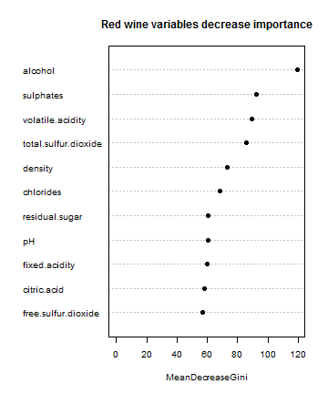

Portuguese "Vinho Verde" wine quality prediction App
========================================================
author: Massimo Forni
date: 3rd october 2016 
autosize: true 
css: custom.css 

Introduction
========================================================
This presentation describes a Shiny interactive application, "App", deployed on Rstudio's servers.

The App goal is the portuguese "Vinho Verde" wine quality prediction, and is built using datasets relate to that variant of wine. 

It presents these tab, described forward in the next slides:

- Quality Prediction
- Model
- Dataset

Links, where find:

- the app [AppWineQuality](https://mowens.shinyapps.io/AppWineQuality) on shiny server  
- file repository [AppWineQuality](https://github.com/mowensdev/AppWineQuality) on github with ui.R, server.R and presentation.Rpres

Quality Prediction
========================================================
Vinho Verde is a Portuguese wine from the Minho region in the far north of the country. The name literally means "Green Wine" (red or white), referring to its youthful freshness that leads to a very slight green color on the edges of the wine.

When the user launches the app three panels are shown, with the pre-selected items values:

1. type of wine, related to two detasets that match the red and white variants of "Vinho Verde" wine

2. the quality will be plotted with respect to one of the 11 variables selected via a drop down menu

3. all the 11 predictor variables, present in the datasets, whose values can be changed by adjusting the corresponding sliders

The values of the variables are summarized in a table, above which the result of the corresponding quality is indicated.

The wine quality score is based on sensory data, made by wine experts, assigned grade between 0 (very bad) and 10 (very excellent).

Model
========================================================
The prediction is based on Random Forest model, related to the variant of wine.
To get the model every dataset, the observations (1599 for red wine and 4898 for white one) contained into them, it has been split in 80% for the training set and the rest for testing set.


This is the red wine variant model obtained:

```r
modelredWine <- randomForest(quality ~ ., data = wineRTrng, ntree = 150)
```

that give this prediction:

```
     
predR   3   4   5   6   7   8
    3   0   1   0   0   0   0
    4   0   0   0   0   0   0
    5   1   7 102  29   3   0
    6   1   1  34  94  17   1
    7   0   1   0   4  19   1
    8   0   0   0   0   0   1
```


with the 68.1 % of accuracy. For the white wine variant is obtained 69.1 % of accuracy.

Dataset
========================================================
The two public datasets used, containing vinho verde wine samples, available at [UCI Machine Learnig Repository](https://archive.ics.uci.edu/ml/datasets/wine+Quality)
and created by: 
<span style="font-style: italic">P. Cortez, A. Cerdeira, F. Almeida, T. Matos and J. Reis.
Modeling wine preferences by data mining from physicochemical properties. In Decision Support Systems, Elsevier, 47(4):547-553, 2009.</span>

There are 11 variables, based on physicochemical tests, and last one, quality, based on sensory data, made by wine experts. In relation to a specified model these are the predictor:


